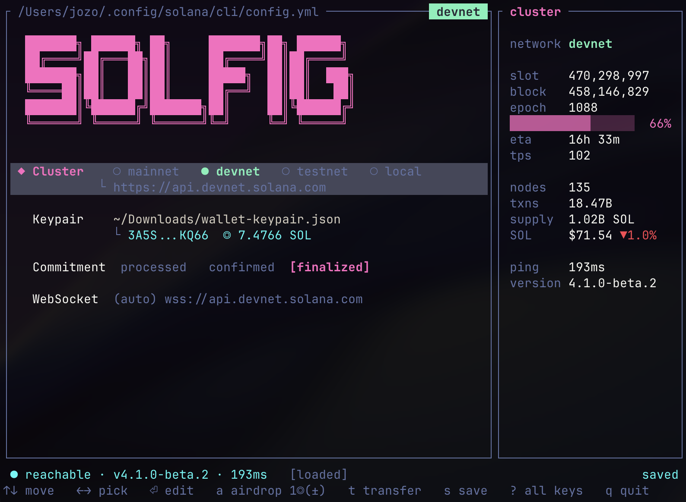

# SOLFIG

[](https://github.com/rokoperki/solfig/actions/workflows/ci.yml)
[](https://crates.io/crates/solfig)
[](#license)

A terminal UI for the Solana CLI config. Edit your cluster, keypair, commitment,
and websocket in `~/.config/solana/cli/config.yml` while watching live cluster
telemetry and your wallet balance — without hand-editing YAML or memorizing
`solana config set` flags.



## Features

- **Edit the CLI config** — RPC URL (cluster), keypair, commitment, and
  websocket, written back atomically to `config.yml`.
- **One-key cluster switching** — built-in monikers (mainnet-beta, devnet,
  testnet, localhost) plus your own saved endpoints.
- **Live telemetry sidebar** — slot, block height, epoch progress + ETA, TPS,
  validator count, transaction count, circulating supply, SOL/USD price, and
  RPC ping/version. Values are cached per-cluster so switching is instant.
- **Wallet** — derives and displays your pubkey and balance, requests airdrops
  (non-mainnet), and sends SOL transfers.
- **Keypair picker** — fuzzy-filter keypairs discovered under
  `~/.config/solana`, `~/Downloads`, and the current directory; generate a fresh
  one in place.
- **Custom RPC endpoints & web faucets** — save named endpoints and open faucets
  in your browser (copying your pubkey to the clipboard).
- **Profiles** — save and switch between whole config environments.
- **Themes** — seven built-in palettes with live preview, plus your own.

## Requirements

- A terminal (uses [ratatui](https://ratatui.rs) / crossterm).
- **For builds:** a recent Rust toolchain (`cargo`), edition 2021.
- **For the transfer feature only:** the [`solana`](https://docs.solanalabs.com/cli/install)
  CLI on your `PATH`. SOLFIG shells out to `solana transfer` so the CLI does the
  signing; everything else works without it.

## Install

From source (until published to crates.io):

```sh
git clone https://github.com/rokoperki/solfig
cd solfig
cargo install --path .
```

Or just build the release binary:

```sh
cargo build --release
./target/release/solfig
```

Once published:

```sh
cargo install solfig
```

## Usage

```sh
solfig
```

By default SOLFIG edits the standard Solana CLI config at
`~/.config/solana/cli/config.yml`. To point it at a different file, set:

```sh
SOLANA_CONFIG_FILE=/path/to/config.yml solfig
```

Changes are held in memory until you save with `s`. The status bar shows whether
you have unsaved changes, and quitting with unsaved changes asks for
confirmation.

## Keybindings

Press `?` in the app for the full list. Summary:

| Key | Action |
| --- | --- |
| `↑` `↓` / `j` `k` | Move between fields |
| `←` `→` / `h` `l` | Change value (cluster, commitment) |
| `⏎` | Edit field / open the keypair picker |
| `g` | In the keypair picker: generate a new keypair |
| `a` | Airdrop to the current keypair (non-mainnet) |
| `+` / `-` | Change the airdrop amount |
| `t` | Transfer SOL (`←→` toggles through local wallets) |
| `y` | Copy the focused field's value to the clipboard |
| `o` | Open the address in Solana Explorer |
| `e` | Custom RPC endpoints |
| `f` | Web faucets (open in browser) |
| `p` | Profiles (switch environments) |
| `T` | Themes (live preview) |
| `s` / `r` | Save / reload the config |
| `q` | Quit (asks if there are unsaved changes) |
| `?` | Show all keybindings |

## Configuration & data files

| Path | Purpose |
| --- | --- |
| `~/.config/solana/cli/config.yml` | The Solana CLI config SOLFIG edits (override with `SOLANA_CONFIG_FILE`) |
| `~/.config/solfig/endpoints.yml` | Your saved custom RPC endpoints |
| `~/.config/solfig/faucets.yml` | Saved web faucets (seeded with defaults on first run) |
| `~/.config/solfig/profiles/*.yml` | Saved config profiles |
| `~/.config/solfig/theme.yml` | Active theme name, color overrides, and custom themes |

## Theming

Built-in palettes: `default`, `synthwave`, `dracula`, `gruvbox`, `solarized`,
`nord`, `matrix`. Cycle and preview them live with `T`.

`~/.config/solfig/theme.yml` is created on first run with a documented example.
You can pick a palette, override individual colors, or define your own theme on
top of a base:

```yaml
name: nord

# Override individual slots (color names or #hex):
# accent: "#26e0c0"

# Define your own named themes (they appear in the `T` switcher):
themes:
  mytheme:
    base: nord
    accent: "#ff79c6"
    error:  "#ff5555"
```

## Safety notes

- **Mainnet hazard banner.** When the active cluster is mainnet-beta, SOLFIG
  shows a prominent warning, and the transfer screen reminds you it sends real
  SOL. Airdrops are disabled on mainnet.
- **Keypair file permissions.** Keypairs that SOLFIG generates are written with
  owner-only permissions (`0600`), matching `solana-keygen`.
- **Signing stays in the Solana CLI.** Transfers shell out to `solana transfer`;
  SOLFIG never sends private keys over the network — it only derives the public
  key locally to display the address and balance.
- **Double-check recipients.** Transfers use `--allow-unfunded-recipient`, so a
  valid-but-unintended address will still receive funds. Review the address on
  the confirmation screen before sending.

## Development

```sh
cargo build            # debug build
cargo test             # run the test suite
cargo clippy --all-targets
cargo fmt
```

Project layout:

```
src/
  main.rs        binary entry point + event loop
  lib.rs         library surface shared by the binary and the tests
  app.rs         application state and key handling
  config.rs      Solana CLI config load/save, keypair derivation/generation
  rpc.rs         background worker for RPC probes, airdrops, and transfers
  ui.rs          ratatui rendering
  theme.rs       palette definitions and the theme config
  endpoints.rs   custom RPC endpoint store
  faucets.rs     web faucet store
  profiles.rs    config profile store
tests/
  app.rs config.rs ui.rs   integration tests for the pure logic
```

## License

Licensed under either of

- Apache License, Version 2.0 ([LICENSE-APACHE](LICENSE-APACHE))
- MIT license ([LICENSE-MIT](LICENSE-MIT))

at your option.

Unless you explicitly state otherwise, any contribution intentionally submitted
for inclusion in the work by you, as defined in the Apache-2.0 license, shall be
dual licensed as above, without any additional terms or conditions.
